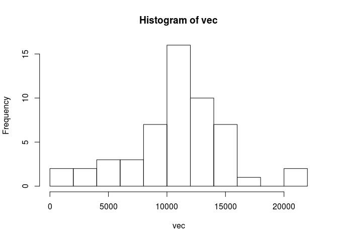
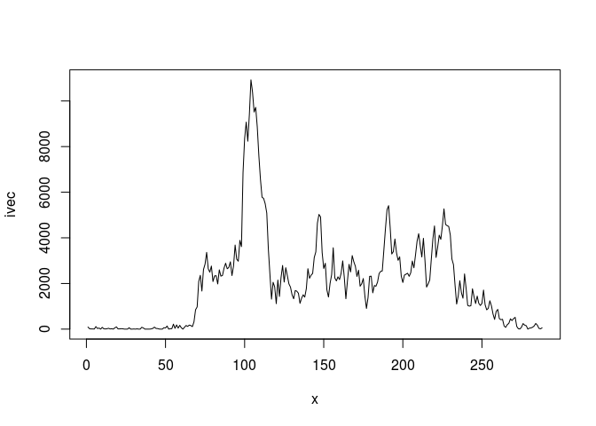
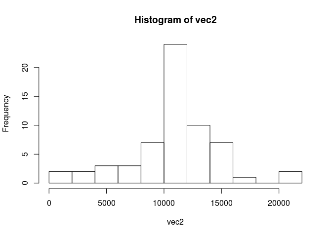
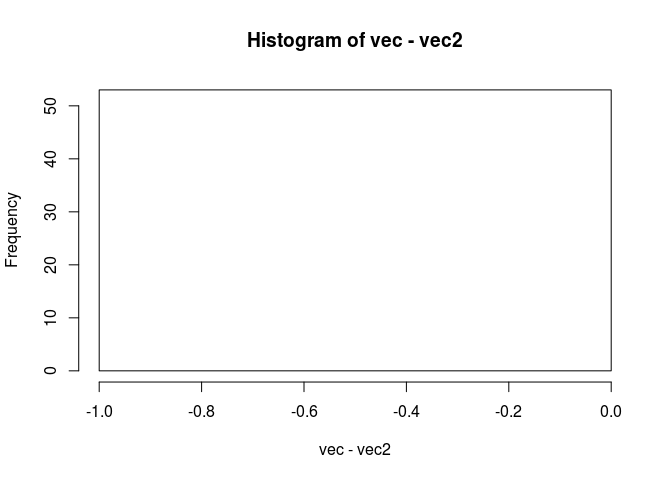
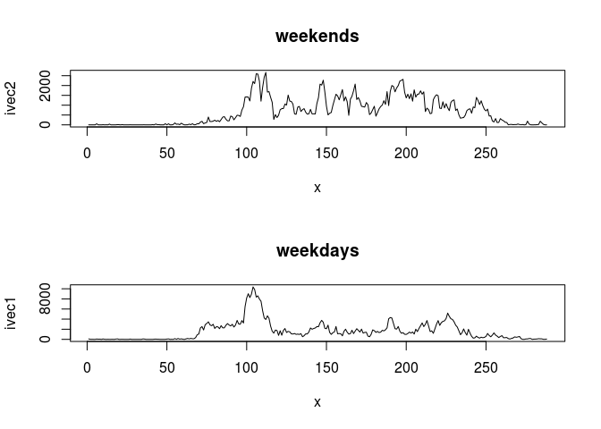

# Reproducible Research: Peer Assessment 1


## Loading and preprocessing the data

```r
activ <- read.csv( "/home/njrood/RepData_PeerAssessment1/activity.csv", sep=",", header = TRUE )
```
No other preprocessing is needed.

## What is mean total number of steps taken per day?

```r
act1 <- split( activ, rep( 1:61, each=288 ) )
vec <- c()
for (i in 1:61) { vec[i] <- sum( act1[i][[1]][1] ) }
hist( vec, breaks=12 )
```

 
Histogram of number of steps taken each day.


```r
mean( vec, na.rm = TRUE )
```

```
## [1] 10766.19
```

```r
median( vec, na.rm = TRUE )
```

```
## [1] 10765
```

## What is the average daily activity pattern?

```r
intrvals <- split( activ, activ$interval, drop = FALSE )
ivec <- c()
for (i in 1:288) { ivec[i] <- sum( unlist(intrvals[[i]][1]), na.rm = TRUE ) }
x <- seq( 1, 288 )
plot( x, ivec, type="l" )
```

 

```r
which.max( ivec )
```

```
## [1] 104
```

## Imputing missing values

```r
nvec <- c()
for (i in 1:61) { nvec[i] <- sum( is.na(act1[[i]][1]) ) }
nvec
```

```
##  [1] 288   0   0   0   0   0   0 288   0   0   0   0   0   0   0   0   0
## [18]   0   0   0   0   0   0   0   0   0   0   0   0   0   0 288   0   0
## [35] 288   0   0   0   0 288 288   0   0   0 288   0   0   0   0   0   0
## [52]   0   0   0   0   0   0   0   0   0 288
```

Number of missing values.

Notice in particular that this number is equal to 8*288.  This is because The "observations" of precisely eight days are all and only the missing data.


```r
vec5 <- c()
for (i in 1:61) { vec5[i] <- length(which( is.na(act1[i][[1]][1]) )) }
vec5
```

```
##  [1] 288   0   0   0   0   0   0 288   0   0   0   0   0   0   0   0   0
## [18]   0   0   0   0   0   0   0   0   0   0   0   0   0   0 288   0   0
## [35] 288   0   0   0   0 288 288   0   0   0 288   0   0   0   0   0   0
## [52]   0   0   0   0   0   0   0   0   0 288
```

This fact makes it easy to impute data from the time step means.  We will simply clobber each missing day with the 5 minute interval means.


```r
mvec <- c()
for (i in 1:288) { mvec[i] <- mean( unlist(intrvals[[i]][1]), na.rm = TRUE ) }
act2 <- act1
act2[[1]][1] <- mvec
act2[[8]][1] <- mvec
act2[[32]][1] <- mvec
act2[[35]][1] <- mvec
act2[[40]][1] <- mvec
act2[[41]][1] <- mvec
act2[[45]][1] <- mvec
act2[[61]][1] <- mvec
vec2 <- c()
for (i in 1:61) { vec2[i] <- sum( act2[i][[1]][1] ) }
hist( vec2, breaks=12 )
```

 

```r
acti2 <- do.call( "rbind", act2 )
```
Histogram of number of steps taken each day for the imputed data.


```r
mean( vec2, na.rm = TRUE )
```

```
## [1] 10766.19
```

```r
median( vec2, na.rm = TRUE )
```

```
## [1] 10766.19
```

```r
hist( vec-vec2, breaks=12 )
```

 

The histogram of the difference shows that the two datasets are off by a constant (unity).

## Are there differences in activity patterns between weekdays and weekends?

```r
v <- c()
for (i in 1:61) { v[i] <- weekdays(as.Date(act2[i][[1]][[2]][1])) }
v
```

```
##  [1] "Monday"    "Tuesday"   "Wednesday" "Thursday"  "Friday"   
##  [6] "Saturday"  "Sunday"    "Monday"    "Tuesday"   "Wednesday"
## [11] "Thursday"  "Friday"    "Saturday"  "Sunday"    "Monday"   
## [16] "Tuesday"   "Wednesday" "Thursday"  "Friday"    "Saturday" 
## [21] "Sunday"    "Monday"    "Tuesday"   "Wednesday" "Thursday" 
## [26] "Friday"    "Saturday"  "Sunday"    "Monday"    "Tuesday"  
## [31] "Wednesday" "Thursday"  "Friday"    "Saturday"  "Sunday"   
## [36] "Monday"    "Tuesday"   "Wednesday" "Thursday"  "Friday"   
## [41] "Saturday"  "Sunday"    "Monday"    "Tuesday"   "Wednesday"
## [46] "Thursday"  "Friday"    "Saturday"  "Sunday"    "Monday"   
## [51] "Tuesday"   "Wednesday" "Thursday"  "Friday"    "Saturday" 
## [56] "Sunday"    "Monday"    "Tuesday"   "Wednesday" "Thursday" 
## [61] "Friday"
```

So nine weeks (of weekdays) with eight weekends between them.


```r
wk <- rep_len( FALSE, 5*288 )
we <- rep_len( TRUE, 2*288 )
w1 <- c( wk, we )
w2 <- rep_len( w1, 8*length(w1) )
w <- c( w2, wk )
actiw <- cbind( acti2, w )
ww <- split( actiw, actiw$w, drop = FALSE )
ww1 <- ww[[1]]
intrww1 <- split( ww1, ww1$interval, drop = FALSE )
ivec1 <- c()
for (i in 1:288) { ivec1[i] <- sum( unlist(intrww1[[i]][1]), na.rm = TRUE ) }
ww2 <- ww[[2]]
intrww2 <- split( ww2, ww2$interval, drop = FALSE )
ivec2 <- c()
for (i in 1:288) { ivec2[i] <- sum( unlist(intrww2[[i]][1]), na.rm = TRUE ) }

layout( matrix(2:1, 2, 1 ))
plot( x, ivec1, type="l", main = "weekdays" )
plot( x, ivec2, type="l", main = "weekends" )
```

 
